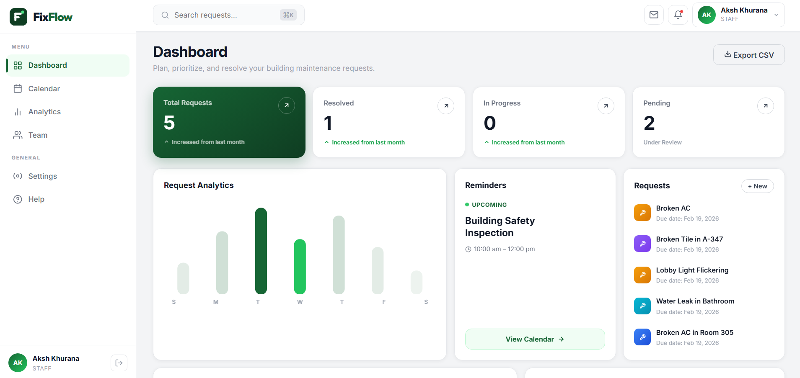

<div align="center">

```
███████╗██╗██╗  ██╗███████╗██╗      ██████╗ ██╗    ██╗
██╔════╝██║╚██╗██╔╝██╔════╝██║     ██╔═══██╗██║    ██║
█████╗  ██║ ╚███╔╝ █████╗  ██║     ██║   ██║██║ █╗ ██║
██╔══╝  ██║ ██╔██╗ ██╔══╝  ██║     ██║   ██║██║███╗██║
██║     ██║██╔╝ ██╗██║     ███████╗╚██████╔╝╚███╔███╔╝
╚═╝     ╚═╝╚═╝  ╚═╝╚═╝     ╚══════╝ ╚═════╝  ╚══╝╚══╝
```

**Enterprise-grade Building Maintenance Management System**


*Streamlining building operations — from submission to resolution*

<br/>



</div>

---

## What is FixFlow?

FixFlow is a production-ready, full-stack maintenance management platform built for modern residential and commercial buildings. It replaces paper forms, email chains, and phone calls with a centralized, role-aware digital workflow — giving tenants, staff, and administrators a single source of truth for every maintenance issue.

The system is engineered around a clear lifecycle: a tenant reports a problem, a manager assigns the right technician, the technician updates progress in real time, and the record is automatically archived once resolved. Every stakeholder sees exactly what they need, nothing more.

---

## Core Capabilities

| Domain | Capability |
|--------|------------|
| **Request Management** | Create, track, and resolve maintenance requests with full audit trail |
| **Role-Based Workflows** | Tenant → Staff → Admin permission tiers with scoped views |
| **Real-Time Dashboard** | Analytics, weekly activity charts, resolution progress gauges |
| **Staff Assignment** | Admins assign requests to specific technicians with one click |
| **Comment Threads** | Threaded communication on every request between all parties |
| **Status Lifecycle** | `OPEN → ASSIGNED → IN_PROGRESS → RESOLVED → CLOSED` enforced at API layer |
| **JWT Authentication** | Stateless, token-based auth with auto-logout on expiry |
| **Responsive Design** | Full mobile support — sidebar collapses, layouts reflow at every breakpoint |

---

## Architecture

```
┌─────────────────────────────────────────────────────────────────┐
│                         CLIENT LAYER                            │
│   Vue 3 (Composition API)  ·  Pinia  ·  Vue Router  ·  Vite   │
│   Chart.js  ·  Axios (JWT interceptor)  ·  Plain CSS           │
└──────────────────────────┬──────────────────────────────────────┘
                           │ HTTP / REST
┌──────────────────────────▼──────────────────────────────────────┐
│                       API GATEWAY (Nginx)                       │
│               Reverse proxy  ·  Static file serving            │
└──────────────────────────┬──────────────────────────────────────┘
                           │
┌──────────────────────────▼──────────────────────────────────────┐
│                     APPLICATION LAYER                           │
│   Spring Boot 3.2  ·  Spring Security  ·  JWT (jjwt 0.12)     │
│   RESTful Controllers  ·  Service Layer  ·  DTOs               │
└──────────────────────────┬──────────────────────────────────────┘
                           │ JPA / Hibernate
┌──────────────────────────▼──────────────────────────────────────┐
│                        DATA LAYER                               │
│              PostgreSQL 15  ·  Spring Data JPA                 │
│         Auto-seeded schema  ·  BCRYPT password hashing         │
└─────────────────────────────────────────────────────────────────┘
```

### Database Schema

```
buildings          users                    maintenance_requests
─────────          ─────                    ────────────────────
id (PK)            id (PK)                  id (PK)
name               email (UNIQUE)           title
address            password_hash            description
total_floors       full_name                category (enum)
                   role (enum)              priority (enum)
                   building_id (FK)         status (enum)
                   created_at               floor_number
                                            room_number
request_comments                            building_id (FK)
────────────────                            created_by (FK → users)
id (PK)                                     assigned_to (FK → users)
request_id (FK)                             created_at
user_id (FK)                                updated_at
comment_text                                resolved_at
created_at
```

---

## Software Development Life Cycle

### 1 · Requirements & Analysis

**Problem Statement**
Building management teams waste significant time coordinating repairs through fragmented communication channels. Tenants lack visibility into whether their reported issues are being addressed. Staff receive assignments through informal means — messages, sticky notes, verbal instructions — with no accountability trail.

**Stakeholder Personas**

| Persona | Pain Point | FixFlow Solution |
|---------|-----------|-----------------|
| **Tenant** | No way to know if my request was received or when it will be fixed | Real-time status updates throughout the lifecycle |
| **Maintenance Staff** | Unclear priorities, assignment conflicts, no structured workflow | Assigned task queue with defined status progression |
| **Building Admin** | No oversight of open issues, staff workload, or resolution trends | Analytics dashboard, assignment controls, full audit log |

**Functional Requirements (MoSCoW)**

- **Must Have:** Authentication, request CRUD, status workflow, role-based access
- **Should Have:** Staff assignment, comment threads, dashboard analytics
- **Could Have:** Email notifications, file attachments, mobile app
- **Won't Have (v1):** IoT sensor integration, billing, vendor management

**Non-Functional Requirements**

- API response time < 200ms (p95) under normal load
- Stateless JWT auth — horizontally scalable
- WCAG 2.1 AA accessible UI
- Docker-first deployment — zero manual environment setup
- All secrets via environment variables — no hardcoded credentials

---

### 2 · System Design

**API Contract (REST)**

```
Auth
  POST   /api/auth/register       Register new user
  POST   /api/auth/login          Authenticate, receive JWT

Requests
  GET    /api/requests            All requests (staff/admin)
  GET    /api/requests/my         Requests by current user
  GET    /api/requests/:id        Request detail
  POST   /api/requests            Create request (tenant)
  PATCH  /api/requests/:id/status Update workflow status
  PATCH  /api/requests/:id/assign Assign staff member (admin)

Comments
  GET    /api/requests/:id/comments   Thread on request
  POST   /api/requests/:id/comments   Add comment

Dashboard
  GET    /api/dashboard/stats     Aggregated metrics (staff/admin)

Buildings
  GET    /api/buildings           Available buildings

Users
  GET    /api/users/staff         Staff list (admin)
```

**Security Model**

```
Endpoint Class                       Roles Permitted
──────────────────────────────────   ───────────────
POST /auth/**                        PUBLIC
GET  /buildings                      PUBLIC
GET  /requests/my                    TENANT
POST /requests                       TENANT
GET  /requests, /dashboard/**        STAFF, ADMIN
PATCH /requests/:id/status           STAFF, ADMIN
PATCH /requests/:id/assign           ADMIN only
GET  /users/staff                    ADMIN only
```

**Frontend Architecture**

```
src/
├── views/              Route-level components (pages)
├── components/         Reusable UI atoms and molecules
├── stores/             Pinia state (auth, requests)
├── services/           Axios instance with JWT interceptor
└── router/             Vue Router with navigation guards
```

---

### 3 · Implementation

**Technology Decisions**

| Decision | Choice | Rationale |
|----------|--------|-----------|
| Backend framework | Spring Boot 3.2 | Mature ecosystem, auto-config, strong security primitives |
| Auth strategy | Stateless JWT | Horizontally scalable, no server-side session storage |
| ORM | Spring Data JPA + Hibernate | Reduced boilerplate, type-safe queries |
| Frontend framework | Vue 3 (Composition API) | Lightweight bundle, excellent reactivity model, gentle learning curve |
| State management | Pinia | Official Vue store, simpler than Vuex, TypeScript-friendly |
| Build tool | Vite 5 | Sub-second HMR, native ESM, fast production builds |
| Styling | Plain CSS + CSS custom properties | Zero runtime overhead, full control, no framework lock-in |
| Database | PostgreSQL 15 | ACID compliance, JSON support, production-proven |
| Containerisation | Docker Compose | Reproducible environments, single-command deployment |

**Code Quality Standards Applied**

- DTOs for all API boundaries — entities never serialised directly
- Service layer enforces all business logic — controllers are thin
- `@PreAuthorize` annotations for fine-grained method security
- BCrypt password hashing (strength 12) — no plaintext storage
- CORS configured per environment — no wildcard in production
- Axios interceptor centralises JWT attachment and 401 handling

---

### 4 · Testing

**Backend Testing Pyramid**

| Layer | Tool | Coverage |
|-------|------|----------|
| Unit — Service logic | JUnit 5 + Mockito | Business rules, status transitions, auth edge cases |
| Integration — API layer | Spring MockMvc + H2 | Full request/response contract per endpoint |
| Security | MockMvc with custom users | Role enforcement on every secured route |

**Frontend Quality Gates**

- Pinia store actions tested in isolation with mock API responses
- Component contracts enforced via prop validation
- Responsive breakpoints manually verified at: 320px, 375px, 480px, 768px, 1024px, 1440px

---

### 5 · Deployment

**Container Architecture**

```yaml
services:
  db:          # PostgreSQL 15 — persistent volume
  backend:     # Spring Boot JAR — depends on db healthcheck
  frontend:    # Nginx — serves built Vue SPA, proxies /api
```

**Environment Configuration**

| Variable | Description |
|----------|-------------|
| `DB_URL` | JDBC connection string |
| `DB_USERNAME` | Database user |
| `DB_PASSWORD` | Database password |
| `JWT_SECRET` | HMAC-SHA256 signing key (≥ 32 chars) |
| `JWT_EXPIRATION` | Token TTL in milliseconds |

**Production Checklist**

- [ ] Replace default JWT secret with cryptographically random value
- [ ] Set `spring.jpa.hibernate.ddl-auto=validate` (not `update`)
- [ ] Configure CORS `allowed-origins` to your domain only
- [ ] Enable HTTPS via reverse proxy (Caddy / nginx / Cloudflare)
- [ ] Set `LOG_LEVEL=INFO` — disable DEBUG in prod
- [ ] Mount PostgreSQL data directory to persistent volume
- [ ] Configure container health checks and restart policies

---

### 6 · Maintenance & Observability

**Operational Endpoints**

| Endpoint | Purpose |
|----------|---------|
| `GET /actuator/health` | Liveness + readiness probe |
| `GET /actuator/info` | Build info, version metadata |
| `GET /actuator/metrics` | JVM, HTTP, and custom metrics |

**Monitoring Recommendations**

- Expose `/actuator/prometheus` and scrape with Prometheus + Grafana
- Alert on: `http_server_requests` p99 > 500ms, error rate > 1%, JVM heap > 80%
- Log aggregation: route container stdout to Loki or CloudWatch Logs
- Database: enable `pg_stat_statements` for query performance insights

---

## Role Reference

```
ADMIN ─── Full system access
  │         Assign staff to requests
  │         View all analytics and reports
  │         Manage buildings and users
  │
STAFF ─── Operational access
  │         View and update all requests
  │         Advance status through workflow
  │         Add comments and notes
  │
TENANT ── Self-service access
            Submit maintenance requests
            Track own request status
            Communicate via comments
```

---

## Request Lifecycle

```
  ┌──────┐   assigned    ┌──────────┐   start work  ┌─────────────┐
  │ OPEN │ ─────────────▶│ ASSIGNED │──────────────▶│ IN_PROGRESS │
  └──────┘               └──────────┘               └──────┬──────┘
                                                           │ resolve
                                                           ▼
                                                    ┌──────────┐   close   ┌────────┐
                                                    │ RESOLVED │──────────▶│ CLOSED │
                                                    └──────────┘           └────────┘
```

Each transition is validated server-side. Clients cannot skip steps or move backwards.

---

## Project Structure

```
fixflow/
├── backend/
│   └── src/main/java/com/fixflow/
│       ├── config/          SecurityConfig, JwtUtil, CorsConfig
│       ├── controller/      REST controllers (thin, delegate to services)
│       ├── service/         Business logic, workflow enforcement
│       ├── model/           JPA entities
│       ├── dto/             Request/response transfer objects
│       ├── repository/      Spring Data interfaces
│       └── security/        JWT filter, UserDetailsService
│
├── frontend/
│   └── src/
│       ├── views/           DashboardView, LoginView, MyRequestsView, RequestDetailView
│       ├── components/      Navbar, StatsOverview, RequestCard, RequestForm, CommentSection
│       ├── stores/          authStore, requestStore (Pinia)
│       ├── services/        api.js (Axios + JWT interceptor)
│       └── router/          index.js (guards, role-based routing)
│
├── docker-compose.yml
└── README.md
```

---

## Demo Credentials

| Role | Email | Password |
|------|-------|----------|
| Admin | `admin@fixflow.com` | `admin123` |
| Staff | `staff@fixflow.com` | `staff123` |
| Tenant | `tenant@fixflow.com` | `tenant123` |

> Demo accounts are seeded automatically on first container startup.
> Remove the data initialiser (`DataInitializer.java`) before going live.

---

## License

MIT © FixFlow Contributors

---

<div align="center">
Built with Spring Boot · Vue 3 · PostgreSQL · Docker
</div>
